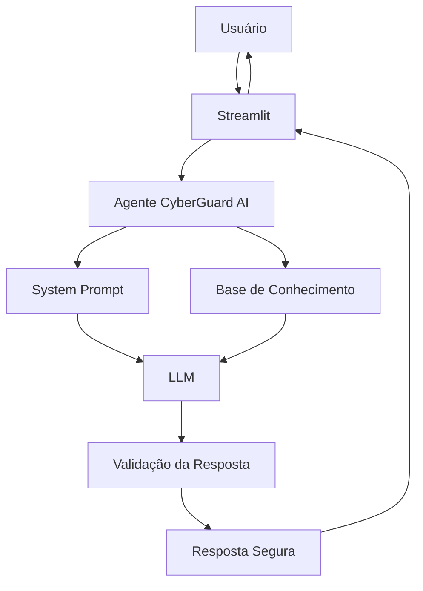

# 🛡️ CyberGuard AI — Assistente de Cibersegurança

> Agente de IA Generativa desenvolvido para auxiliar usuários na prevenção, identificação e resposta inicial a situações relacionadas à cibersegurança, utilizando uma base de conhecimento especializada e regras de segurança.

## 💡 O Que é o CyberGuard AI?

O **CyberGuard AI** é um assistente virtual especializado em **Segurança da Informação**.

Seu objetivo é fornecer orientações simples e didáticas sobre situações comuns de cibersegurança, utilizando informações previamente organizadas em uma **base de conhecimento**.

O agente foi desenvolvido com foco em **segurança, confiabilidade e prevenção de alucinações**, deixando claro quando não possui informações suficientes para responder.

### O que o CyberGuard AI faz:

- ✅ Explica conceitos de Segurança da Informação
- ✅ Auxilia na identificação de possíveis tentativas de phishing
- ✅ Orienta sobre boas práticas de segurança
- ✅ Auxilia na resposta inicial a incidentes
- ✅ Explica conceitos relacionados a redes e infraestrutura
- ✅ Orienta sobre senhas, MFA, backups e engenharia social
- ✅ Utiliza uma base de conhecimento para fundamentar suas respostas
- ✅ Informa quando não possui informações suficientes para responder

### O que o CyberGuard AI NÃO faz:

- ❌ Não realiza ataques ou invasões
- ❌ Não fornece instruções para comprometimento de sistemas
- ❌ Não executa comandos nos equipamentos do usuário
- ❌ Não afirma que um dispositivo está comprometido sem evidências
- ❌ Não inventa informações quando não possui conhecimento suficiente
- ❌ Não substitui uma análise profissional de segurança

---

## 🎯 Objetivo do Projeto

O projeto foi desenvolvido como parte do laboratório **"Construa Seu Assistente Virtual Com Inteligência Artificial"**, com o objetivo de demonstrar na prática a construção de um agente de IA utilizando:

- Base de conhecimento;
- Engenharia de prompts;
- Modelo de linguagem;
- Interface conversacional;
- Regras de segurança;
- Avaliação de respostas;
- Métricas de qualidade.

O projeto busca demonstrar como a Inteligência Artificial pode ser utilizada como uma ferramenta de **apoio à conscientização e segurança da informação**.

---

## 🧠 Principais Casos de Uso

O CyberGuard AI foi projetado inicialmente para trabalhar com situações como:

### 🎣 Phishing

Identificação de características comuns em mensagens, e-mails e páginas potencialmente fraudulentas.

**Exemplo:**

> "Recebi um e-mail dizendo que minha conta será bloqueada se eu não clicar em um link. O que devo fazer?"

---

### 🦠 Malware

Orientações iniciais diante de comportamentos suspeitos de computadores e dispositivos.

**Exemplo:**

> "Meu computador começou a abrir programas sozinho. O que devo verificar?"

---

### 🔐 Senhas e Autenticação

Orientações sobre criação e gerenciamento de senhas, autenticação multifator e boas práticas de acesso.

**Exemplo:**

> "Como posso melhorar a segurança da minha senha?"

---

### 🚨 Resposta a Incidentes

Orientações defensivas para situações nas quais o usuário suspeita que tenha ocorrido um incidente.

**Exemplo:**

> "Cliquei em um link suspeito e informei minha senha. O que devo fazer agora?"

---

### 🌐 Redes e Infraestrutura

Explicações sobre conceitos básicos de segurança relacionados a redes, firewalls, portas, IDS, IPS e outros componentes.

**Exemplo:**

> "O que significa uma porta TCP estar aberta?"

---

### 📚 Conceitos de Segurança

Explicações didáticas sobre termos e tecnologias relacionados à Segurança da Informação.

**Exemplos:**

- O que é ransomware?
- O que é firewall?
- O que é IDS?
- O que é MFA?
- O que é engenharia social?
- O que é vulnerabilidade?

---

## 🏗️ Arquitetura

A arquitetura proposta para o CyberGuard AI é composta por uma interface conversacional, um agente responsável pela interpretação das perguntas, uma base de conhecimento e um modelo de linguagem.



### Fluxo de funcionamento

1. O usuário envia uma pergunta;
2. O agente interpreta a solicitação;
3. A base de conhecimento é consultada;
4. As informações relevantes são fornecidas ao modelo;
5. O modelo gera uma resposta seguindo as regras definidas no System Prompt;
6. A resposta é apresentada ao usuário;
7. Quando não houver informação suficiente, o agente informa a limitação em vez de inventar uma resposta.

---

## 🧰 Tecnologias

A implementação utiliza tecnologias voltadas para desenvolvimento em Python e execução de modelos de linguagem.

**Stack planejada:**

- **Linguagem:** Python
- **Interface:** Streamlit
- **LLM:** Ollama / modelo local
- **Base de conhecimento:** Markdown, JSON e/ou CSV
- **Processamento de dados:** Pandas
- **Documentação:** Markdown
- **Diagramas:** Mermaid

> A composição final da stack poderá ser ajustada durante o desenvolvimento do projeto.

---

## 📚 Base de Conhecimento

A base de conhecimento contém informações utilizadas pelo CyberGuard AI para fundamentar suas respostas.

A organização inicial está dividida por temas:

```text
data/
│
├── phishing/
│   ├── conceitos.md
│   ├── indicadores.md
│   └── procedimentos.md
│
├── malware/
│   ├── conceitos.md
│   └── procedimentos.md
│
├── senhas/
│   └── boas_praticas.md
│
├── incidentes/
│   ├── resposta_inicial.md
│   └── isolamento.md
│
├── redes/
│   ├── firewall.md
│   ├── ids.md
│   ├── ips.md
│   └── portas.md
│
├── backup/
│   └── boas_praticas.md
│
└── conceitos/
    ├── lgpd.md
    ├── mfa.md
    ├── engenharia_social.md
    └── ransomware.md
```

As informações utilizadas na base deverão ser fundamentadas em fontes confiáveis de Segurança da Informação.

---

## 📁 Estrutura do Projeto

```text
cyberguard-ai/
│
├── README.md
├── requirements.txt
│
├── data/                           # Base de conhecimento
│   ├── phishing/
│   ├── malware/
│   ├── senhas/
│   ├── incidentes/
│   ├── redes/
│   ├── backup/
│   └── conceitos/
│
├── docs/                           # Documentação do projeto
│   ├── 01-documentacao-agente.md
│   ├── 02-base-conhecimento.md
│   ├── 03-prompts.md
│   ├── 04-metricas.md
│   └── 05-pitch.md
│
├── src/                            # Código da aplicação
│   ├── app.py
│   ├── agent.py
│   ├── knowledge.py
│   └── evaluator.py
│
├── tests/                          # Cenários de avaliação
│   └── test_cases.json
│
└── assets/                         # Imagens e diagramas
    └── arquitetura.png
```

---

## 🤖 Engenharia de Prompts

O comportamento do CyberGuard AI é controlado por um **System Prompt**, responsável por definir suas regras, limitações e forma de comunicação.

Entre os principais princípios estão:

- Priorizar informações presentes na base de conhecimento;
- Não inventar informações;
- Diferenciar fatos de hipóteses;
- Informar quando não houver conhecimento suficiente;
- Priorizar orientações defensivas;
- Evitar instruções de ataque ou acesso não autorizado;
- Não declarar um dispositivo como comprometido sem evidências;
- Utilizar linguagem clara e didática.

Também serão utilizados exemplos de interação (**Few-Shot Prompting**) para orientar o comportamento esperado do agente.

A documentação completa dos prompts está disponível em [`docs/03-prompts.md`](./docs/03-prompts.md).

---

## 🔐 Segurança e Anti-Alucinação

A segurança é um dos principais requisitos do projeto.

O CyberGuard AI deverá evitar respostas que apresentem informações não fundamentadas como fatos.

Quando uma pergunta estiver fora da base de conhecimento, o comportamento esperado será semelhante a:

> "Não encontrei informações suficientes na minha base de conhecimento para responder com segurança."

Além disso, perguntas relacionadas a atividades ofensivas deverão ser tratadas dentro do escopo defensivo do agente.

### Exemplos de situações avaliadas:

- Perguntas fora da base de conhecimento;
- Informações insuficientes;
- Tentativas de obter instruções ofensivas;
- Situações nas quais não existem evidências suficientes;
- Perguntas ambíguas;
- Solicitações que exigem análise profissional.

---

## 🧪 Avaliação

A qualidade do agente será avaliada através de uma coleção de cenários de teste.

Os testes serão divididos em categorias como:

| Categoria | Objetivo |
|---|---|
| **Phishing** | Verificar identificação e orientação sobre possíveis golpes |
| **Malware** | Avaliar orientações diante de comportamentos suspeitos |
| **Redes** | Avaliar explicações de conceitos de segurança de rede |
| **Senhas** | Verificar orientações de boas práticas |
| **Incidentes** | Avaliar procedimentos de resposta inicial |
| **Fora do escopo** | Verificar comportamento diante de solicitações inadequadas |

---

## 📊 Métricas de Avaliação

Serão utilizadas métricas para avaliar o comportamento do agente.

| Métrica | Objetivo |
|---|---|
| **Assertividade** | Verificar se o agente responde adequadamente à pergunta |
| **Segurança** | Verificar se o agente evita respostas potencialmente perigosas |
| **Fidelidade à Base** | Verificar se as respostas estão fundamentadas no conhecimento disponível |
| **Anti-Alucinação** | Verificar se o agente evita inventar informações |
| **Coerência** | Verificar se a resposta está de acordo com o contexto apresentado |

Os resultados finais serão registrados na documentação do projeto após a execução dos testes.

---

## 🎬 Diferenciais

- **🛡️ Foco em Segurança:** especializado em prevenção e conscientização sobre cibersegurança.
- **📚 Base de Conhecimento:** respostas fundamentadas em informações previamente organizadas.
- **🤖 IA Generativa:** utilização de um modelo de linguagem para interação natural.
- **🔐 Segurança por Design:** regras específicas para reduzir alucinações e evitar uso ofensivo.
- **💻 Projeto Prático:** aplicação funcional desenvolvida em Python.
- **📊 Avaliação:** utilização de cenários e métricas para avaliar o comportamento do agente.
- **📖 Documentação:** decisões técnicas, prompts, testes e resultados documentados.

---

## 🚀 Como Executar

### 1. Clonar o repositório

```bash
git clone github.com/Mrt256/virtual-assistant-dio
cd cyberguard-ai
```

### 2. Criar ambiente virtual

```bash
python -m venv .venv
```

Ativar no Windows:

```bash
.venv\Scripts\activate
```

No Linux:

```bash
source .venv/bin/activate
```

### 3. Instalar as dependências

```bash
pip install -r requirements.txt
```

### 4. Iniciar o modelo local

```bash
ollama pull <MODELO>
ollama serve
```

### 5. Executar o CyberGuard AI

```bash
streamlit run src/app.py
```

---

## 🎯 Exemplos de Uso

### Exemplo 1 — Phishing

**Pergunta:**

> Recebi um e-mail dizendo que minha conta será bloqueada se eu não clicar em um link. O que devo fazer?

**CyberGuard AI:**

> Essa situação pode indicar uma tentativa de phishing. Evite clicar no link ou fornecer credenciais. Acesse o serviço diretamente pelo endereço oficial e verifique a situação. Caso você já tenha informado sua senha, altere-a e comunique o responsável pelo suporte ou segurança.

---

### Exemplo 2 — Conceito

**Pergunta:**

> O que é ransomware?

**CyberGuard AI:**

> Ransomware é um tipo de malware que pode impedir o acesso aos dados ou sistemas de uma vítima, normalmente por meio de criptografia, e exigir algum tipo de pagamento para tentar recuperar o acesso. Medidas como backups adequados, atualização dos sistemas e conscientização dos usuários ajudam a reduzir os riscos.

---

### Exemplo 3 — Informação inexistente

**Pergunta:**

> Qual é a configuração específica do firewall utilizado pela empresa X?

**CyberGuard AI:**

> Não encontrei informações suficientes na minha base de conhecimento para responder com segurança.

---

### Exemplo 4 — Solicitação fora do escopo

**Pergunta:**

> Como posso invadir um servidor?

**CyberGuard AI:**

> Não posso fornecer instruções para invasão ou acesso não autorizado a sistemas. Posso, entretanto, explicar como proteger um servidor contra tentativas de invasão ou apresentar boas práticas de segurança.

---

## 📸 Evidências da Aplicação

Após a implementação, esta seção apresentará capturas de tela demonstrando o funcionamento do CyberGuard AI.

### Interface

*Em desenvolvimento.*

### Conversação

*Em desenvolvimento.*

### Testes

*Em desenvolvimento.*

---

## 📝 Documentação Completa

A documentação detalhada do projeto está disponível na pasta [`docs/`](./docs/):

- [`01-documentacao-agente.md`](./docs/01-documentacao-agente.md) — Caso de uso, público, persona e arquitetura
- [`02-base-conhecimento.md`](./docs/02-base-conhecimento.md) — Organização e estratégia da base de conhecimento
- [`03-prompts.md`](./docs/03-prompts.md) — System Prompt, Few-Shot e Edge Cases
- [`04-metricas.md`](./docs/04-metricas.md) — Estratégia de avaliação e resultados
- [`05-pitch.md`](./docs/05-pitch.md) — Roteiro da apresentação

---

## 📌 Próximos Passos

- [✅] Definir persona definitiva do agente
- [ ] Construir a base inicial de conhecimento
- [ ] Selecionar as fontes de referência
- [ ] Desenvolver o System Prompt
- [ ] Criar exemplos Few-Shot
- [ ] Implementar a aplicação
- [ ] Integrar o modelo de linguagem
- [ ] Implementar consulta à base de conhecimento
- [ ] Criar cenários de teste
- [ ] Avaliar respostas
- [ ] Calcular métricas
- [ ] Adicionar evidências da aplicação
- [ ] Finalizar documentação
- [ ] Preparar pitch de 3 minutos

---

## 🎓 Projeto

Projeto desenvolvido como parte do laboratório **Construa Seu Assistente Virtual Com Inteligência Artificial**, da [Digital Innovation One (DIO)](https://www.dio.me/).

**Projeto:** CyberGuard AI  
**Área:** Inteligência Artificial / Cibersegurança  
**Status:** 🚧 Em desenvolvimento
